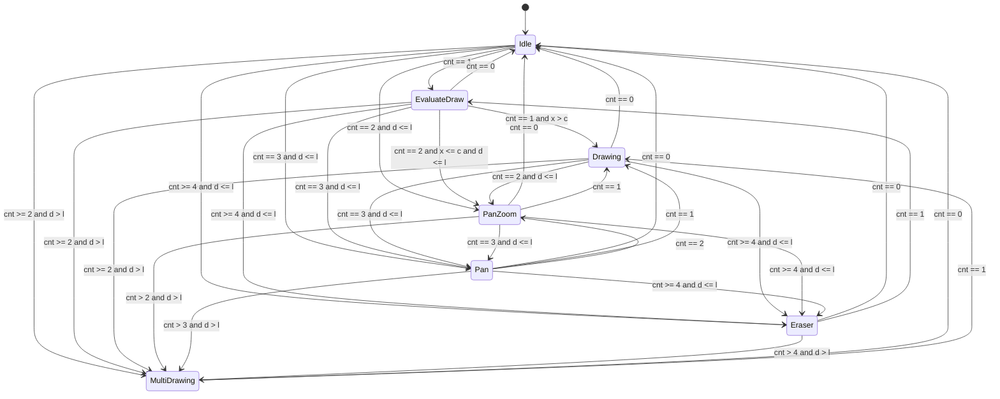

# Touch State Machine

- `and`: all conditions should be true.
- `d`: the current max distance of the fingers.
- `l`: distance threshold, set to `0.5 * ActualWidth`.
- `c`: displacement threshold, set to 10px.
- `cnt`: the current finger count.
- `x`: the displacement of the first finger.

- Assumes
    - if something changed, but not match any condition of current state, stay.
    - The transition only happends when `cnt` changes.
    - `d > l` never happend unless a new finger down.
        - Because: `d > l` goes to `MultiDrawing`, `MultiDrawing` is designed to let two people put down finger on the two side (far away in distance) of a huge screen. In real situation, `l` is set to the value that a normal human can hardly let `d` reaching.

- Requires
    - When `EvaluateDraw --> Drawing`, keep the drawed stroke.
    - When `Idle --> *`, save the editing mode.
    - When `* --> Idle`, restore the editing mode.

- Coding
    - Notice we're using C# latest.
    - Use `var` when the type is obvious.
    - Follow the code style of other part.
    - When writing math calculate function, use `LINQ` in order to improve performance.
    - Avoid allocate big heap item (like `List<T>`), use alternative data structure or methods.
    - When not sure, ask me.
    - When compressing the context, keep this document.
    - `MultiDrawing` now unimpl, use `InkCanvasEditingMode.Ink` as current impl.

