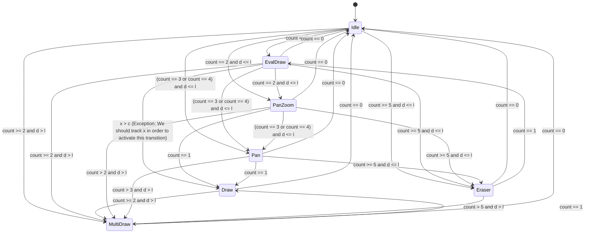

# Touch State Machine

- `and`: all conditions should be true.
- `d`: the current max distance of the fingers.
- `l`: distance threshold, set to `0.6 * ActualWidth`.
- `c`: displacement threshold, set to 15px.
- `count`: the current finger count.
- `x`: the displacement of the first finger.

- Assumes
    - if something changed, but not match any condition of current state, stay.
    - The transition only happends when `count` changes.
    - `d > l` never happend unless a new finger down.
        - Because:
          - This state machines is designed for a enough huge screen.
          - `d > l` goes to `MultiDraw`. `MultiDraw` is designed to let two people put down finger on the two side.

- Requires
    - When `EvalDraw --> Draw`, keep the drawed stroke.
    - When `Idle --> *`, save the editing mode.
    - When `* --> Idle`, restore the editing mode.

- Coding
    - Notice we're using C# latest.
    - Use `var` when the type is obvious.
    - Follow the code style of other part.
    - Avoid allocating big heap item (like `List<T>`).
    - When not sure, ask me.
    - When compressing the context, keep this document.
    - `MultiDraw` now unimpl, use `InkCanvasEditingMode.Ink` as current impl.

