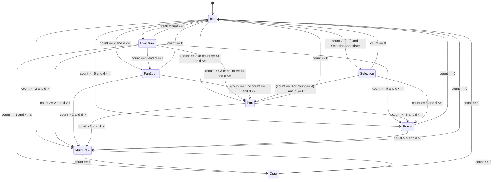

# 触摸状态机 v2

> 本文件是 `docs/TouchStates.md`（v1）的更新版，描述 `States.cs` 当前实现。
> 主要变化：新增 `Selection` 状态；入口按优先级判定（选区 > MultiDraw > 单指 > 平移）；副作用由"退出源 + 进入目标"组合推导；`MultiDraw` 已实现（不再用 `InkCanvasEditingMode.Ink` 顶替）。

## 符号

- `and`: 所有条件同时成立。
- `count`: 当前按下触点数。
- `d`: 触点间的最大两两距离（`GetMaxDistance2`）。
- `l`: 距离阈值。`l = DistanceThresholdFactor * WorkArea.Width`，其中 `DistanceThresholdFactor` 在 DEBUG 下为 `0.9`、RELEASE 下为 `0.1`（注意：与 v1 的 `0.6 * ActualWidth` 不同）。
- `c`: 位移阈值，固定 `20px`（`touchDisplThreshold`）。
- `x`: 首指相对按下点的位移（`Get1stFingerDispl2`）。
- 比较均用**平方距离**（免 `sqrt`）：`d2 <= l2`、`x2 > c2`；每次重评 `d2`/`x2` 只计算一次。

## 状态

`Idle`、`EvalDraw`、`Draw`、`PanZoom`、`Pan`、`Eraser`、`MultiDraw`、`Selection`（新增）。

## 假设

- 条件变化但未命中当前状态的任何迁移 → 停留（stay）。
- 迁移只在 `count` 变化时重评；例外：`EvalDraw` 下 Move 时重评，以激活 `EvalDraw --> Draw`（需持续跟踪 `x`）。
- `d > l` 若无新手指落下则不会发生：
    - 状态机面向足够大的屏幕设计；
    - `d > l` 进入 `MultiDraw`，供两人在大屏两侧各落一指同时书写。
- 选区入口仅在 `count ∈ {1, 2}` 且 `Mode == Select && StampAction == None` 时考虑；3+ 指不进入选区。
- 优先级（自上而下，即 switch 臂顺序）：**选区 > MultiDraw > 单指（EvalDraw/Draw）> 平移（PanZoom/Pan）> 橡皮（Eraser）**。
    - 例：`Idle` 下 `count == 1` 且选区候选成立 → `Selection`（而非 `EvalDraw`）；`count == 2` 同理压过 `PanZoom`。
- `Selection` 内部不做 `d`/`l` 分析（`count ∈ {1,2}` 时维持选区手势）；`count == 0` 回 `Idle`。附加手指触发画布级手势：`count ∈ {3,4}` 且 `d <= l` → `Pan`（Select 模式下 3/4 指平移画布，退出时 `EndSelectionTouch` 提交当前变换）；`count >= 5` 且 `d <= l` → `Eraser`（掌心擦除）。
- `PanZoom` 中减为单指（`count == 1`）迁入 `Pan`，此后落下第二指也停在 `Pan`（`Pan` 无回 `PanZoom` 的迁移），需全部抬起重新开始双指手势。

## 要求（副作用）

- 进入 `Idle`：`ReleaseAll` + `RestoreMode`。
- 离开 `Idle`：保存 `prevMode = Mode`（供 `RestoreMode` 还原）。
- 离开 `MultiDraw`：`EndMultiTouch`。
- 离开 `Selection`：`EndSelectionTouch`。
- 离开 `EvalDraw`/`Draw` 进入手势接管态（`PanZoom`/`Pan`/`MultiDraw`/`Eraser`/`Selection`，或异常回 `Idle`）：若形状在途（`shapeActive`）→ `CancelShape`。形状只允许在单指绘制上下文（`EvalDraw`/`Draw`）存活；`EvalDraw` 中落第二指即迁入 `PanZoom`/`MultiDraw` 并放弃预览（捏合缩放优先）；`Draw` 中落第二指**无条件**迁入 `MultiDraw` 并放弃形状（两指转入多指画笔）。
- 离开"覆盖编辑模式"的状态（`PanZoom`/`Pan`/`MultiDraw`/`Eraser`）进入非覆盖状态 → `RestoreMode`（如 `MultiDraw --> Draw` 需恢复 `EditingMode`）。
- 进入 `EvalDraw`，或 `EvalDraw --> Draw`：若 `WantsPreemptiveDrawCapture` → `CaptureAll`。
- 进入 `Selection`：`CaptureAll` + `BeginSelectionTouch`。
- 进入 `PanZoom`/`Pan`：
    - `from != PanZoom` 时：`ReleaseAll` + `Canvas.EditingMode = None` + `CaptureAll`（`PanZoom --> Pan` 只做基准校准，不重做释放/捕获）；
    - 随后 `InitGesture`。
- 进入 `Eraser`：`ReleaseAll` + `Canvas.EditingMode = None` + `CaptureAll`。
- 进入 `MultiDraw`：`ReleaseAll` + `Canvas.EditingMode = None` + `CaptureAll` + `StartMultiTouch`。
- 离开面积擦叠加态（`IsAreaEraserActive(from) && !IsAreaEraserActive(newState)`）：`EndEraserCycle`。
- 离开 `Pan`/`PanZoom` 手势族（迁入 `Idle` 或任一其他状态）：`EnsureEdgeMargin`，即视口距右/下边缘不足一屏时把画布扩展一屏（`Gestures.cs`）。
- `BlocksNativeInput`（全程接管 Down/Move/Up，`Handled`，InkCanvas 不再收笔）：`PanZoom`、`Pan`、`MultiDraw`、`Selection`。
- `OverridesEditingMode`（进入时需把 `EditingMode` 置 `None` 的手势接管状态）：`PanZoom`、`Pan`、`MultiDraw`、`Eraser`。

## 盖章叠加（`StampAction != None`）

- 盖章激活即 `EditingMode = None`（`ApplyModeToEditing` 的盖章分支）：单指不再原生收笔，仅拦截触摸事件压不住手写笔管线；手势进行中激活/退出时由状态机的 `RestoreMode` 延迟应用。
- 单指序列照常进入 `EvalDraw`/`Draw`（事件全程 `Handled`，`WantsPreemptiveDrawCapture` 含盖章），但除落章外无任何功能；**抬手时落章**（按下不落，位置取抬手点）。
- 多指手势照常：`PanZoom`（2 指）、`Pan`（3/4 指）、`Eraser`（5+ 指）可用；`MultiDraw` 被排除（`StartMultiTouchStroke` 直接返回，不创建笔画）。
- 落章条件：`stampArmed`（`Idle --> EvalDraw` 且盖章激活时武装）且抬手时处于 `EvalDraw`/`Draw`。迁入任何手势接管态即解除武装，多指序列抬手不残留落章。
- 鼠标不受状态机管理，仍在按下时立即落章（`TryStamp`）。

## 编码

- 使用 C# latest。
- 类型明显时用 `var`。
- 遵循项目其他部分的代码风格。
- 避免分配大堆对象（如 `List<T>`，用 `Span`/`stackalloc`）。
- 不确定时问我。
- 压缩上下文时，保留本文档。
- `UpdateState` 守卫内联写死：switch 臂自上而下即优先级；`d2`/`x2` 每次重评只计算一次；全部不命中 → 保持当前状态。

