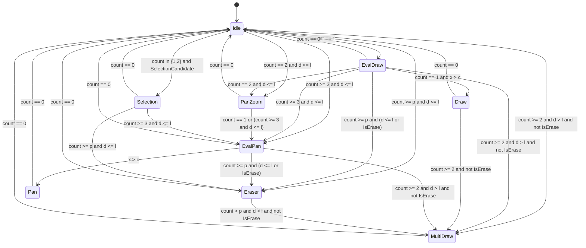

# 触摸状态机 v2

> 本文件是 `docs/TouchStates.md`（v1）的更新版，描述 `States.cs` 当前实现。
> 主要变化：新增 `Selection` 与 `EvalPan` 状态；入口按优先级判定（选区 > MultiDraw > 单指 > 平移）；副作用由"退出源 + 进入目标"组合推导；`MultiDraw` 使用独立的多指笔画实现。

## 符号

- `and`: 所有条件同时成立。
- `count`: 当前按下触点数。
- `d`: 触点间的最大两两距离（`GetMaxDistance2`）。
- `l`: 距离阈值。`l = DistanceThresholdFactor * WorkArea.Width`，其中 `DistanceThresholdFactor` 在 DEBUG 下为 `0.9`、RELEASE 下为 `0.1`（注意：与 v1 的 `0.6 * ActualWidth` 不同）。
- `c`: 位移阈值，默认 `20` 视口 DIP，构造期由 `InkCanvasNextOptions.TouchDisplacementThreshold` 设定。
- `x`: 首指相对按下点的位移（`Get1stFingerDispl2`）。
- `p`: 掌擦触点数，设置中二选一（4 或 5，默认 5），构造期由 `InkCanvasNextOptions.PalmEraseFingers` 设定。
- 比较均用**平方距离**（免 `sqrt`）：`d2 <= l2`、`x2 > c2`；每次重评 `d2`/`x2` 只计算一次。

## 状态

`Idle`、`EvalDraw`、`Draw`、`EvalPan`（新增）、`PanZoom`、`Pan`、`Eraser`、`MultiDraw`、`Selection`。

## 假设

- 条件变化但未命中当前状态的任何迁移 → 停留（stay）。
- 迁移只在 `count` 变化时重评；例外：`EvalDraw`/`EvalPan` 下 Move 时重评，以激活位移提交（需持续跟踪 `x`）。
- `d > l` 若无新手指落下则不会发生：
    - 状态机面向足够大的屏幕设计；
    - `d > l` 进入 `MultiDraw`，供两人在大屏两侧各落一指同时书写。
- 选区入口仅在 `count in {1, 2}` 且 `Mode == Select && StampAction == None` 时考虑；3+ 指不进入选区。
- 优先级（自上而下，即 switch 臂顺序）：`Idle` 与 `EvalDraw` 中选区、单指先于手势态（例：`Idle` 下 `count == 1` 且选区候选成立 → `Selection`；`count == 2` 同理压过 `PanZoom`）；掌擦臂先于平移臂；`MultiDraw` 由 `d > l` 把关，排在其后。
    - 掌擦与平移的触点区间随 `p` 重叠（`p = 4` 时四指两者都满足），顺序决定结果。
- `EvalPan` 是多指平移的评估态（3 指及以上并拢进入，与 `EvalDraw` 对单指的角色相同）：平移随 Move 实时生效；位移超过 `c` 提交为 `Pan`；提交前可迁 `Eraser`（掌擦判定与 `EvalDraw` 同款：`count >= p and (d <= l or IsErase)`）与 `MultiDraw`（张开且非擦除工具）；无回 `PanZoom` 的迁移，减为单指/双指仍停留并继续平移。
- `Pan` 是已提交的平移态：无论触点如何增减、间距如何变化，仅 `count == 0` 回 `Idle`（掌擦与多指书写都只在评估期可达）。
- `PanZoom` 的手势执行只用前两指（`GetMajorTouches`）：并拢的附加指迁 `EvalPan`；张开的附加指不参与迁移（不迁 `MultiDraw`）；减为单指迁 `EvalPan`，此后落下第二指不回 `PanZoom`，需全部抬起重新开始双指手势。
- `Selection` 内部不做 `d`/`l` 分析（`count in {1,2}` 时维持选区手势）；`count == 0` 回 `Idle`。附加手指触发画布级手势：`count >= p` 且 `d <= l` → `Eraser`（掌擦）；其余 `count >= 3` 且 `d <= l` → `EvalPan`（Select 模式下附加手指平移画布，退出时 `EndSelectionTouch` 提交当前变换）。
- 擦除工具（`Mode in {EraseArea, EraseStroke}`，`Tool.IsErase`）的多指手势与普通模式同款（并拢判定：2 指 → `PanZoom`、3 指及以上（不足 `p`）→ `EvalPan`），差异：`count >= p` 无论间距均迁 `Eraser`（手掌压屏常呈张开）；多指张开（`d > l`）不迁 `MultiDraw` 起笔画，保持当前擦除上下文。
- `Draw` 不迁 `Eraser`：绘制一旦提交，掌擦不可达，擦除工具下多指保持原地擦除上下文（`Draw --> MultiDraw` 由 `AllowsMultiDraw` 把关，擦除工具不满足）。
- `Eraser` 中 `count > p` 且 `d > l` 迁 `MultiDraw`（仅非擦除工具）：手掌张开超过掌擦触点数即视为多指书写。
- `MultiDraw` 中抬到单指仍保持 `MultiDraw`，剩下的人继续画；`count == 0` 才回 `Idle`。

## 要求（副作用）

- 进入 `Idle`：`ReleaseAll` + `ApplyModeToEditing(Mode)`。
- 离开 `MultiDraw`：`EndMultiTouch`。
- 离开 `Selection`：`EndSelectionTouch`。
- 离开 `EvalDraw`/`Draw` 进入手势接管态（`EvalPan`/`PanZoom`/`MultiDraw`/`Eraser`/`Selection`，或异常回 `Idle`）：若形状在途（`shapeActive`），迁入 `MultiDraw` 时按当前预览 `CommitShape`，迁入其余状态则 `CancelShape`。形状只允许在单指绘制上下文（`EvalDraw`/`Draw`）存活；`EvalDraw` 中落第二指按距离迁入 `PanZoom`（捏合优先）或 `MultiDraw`；`Draw` 中落第二指迁入 `MultiDraw`（擦除工具被 `AllowsMultiDraw` 拒绝，保持原地擦除上下文，见假设）。
- 离开"覆盖编辑模式"的状态（`PanZoom`/`Pan`/`MultiDraw`/`Eraser`）进入非覆盖状态 → `ApplyModeToEditing(Mode)`（如 `MultiDraw --> Draw` 需恢复 `EditingMode`）。
- 进入 `EvalDraw`，或 `EvalDraw --> Draw`：若 `WantsPreemptiveCapture` → `CaptureAll`。
- 进入 `Selection`：`CaptureAll` + `BeginSelectionTouch`。
- 进入 `EvalPan`/`PanZoom`/`Pan`（平移手势族）：
    - `from` 不在同族时：`ReleaseAll` + `InnerCanvas.EditingMode = None` + `CaptureAll`（族内迁移只做基准校准，不重做释放/捕获）；
    - 随后 `InitGesture`。
- 进入 `Eraser`：`ReleaseAll` + `InnerCanvas.EditingMode = None` + `CaptureAll`。
- 进入 `MultiDraw`：若来自 `EvalDraw`/`Draw` 且原生在绘笔画存在（Ink 模式且已捕获触笔），先 `ReleaseStylusCapture` 触发原生整笔提交（InkCanvas 对中途切换编辑模式的在绘笔画只做丢弃，对捕获丢失才整笔提交）；随后 `ReleaseAll` + `InnerCanvas.EditingMode = None` + `CaptureAll` + `StartMultiTouch`（原绘制指以多指笔画从当前触点续接）。
- 离开面积擦叠加态（`IsAreaEraserActive(from) && !IsAreaEraserActive(newState)`）：`EndEraserCycle`。
- 离开 `EvalPan`/`Pan`/`PanZoom` 手势族（迁入 `Idle` 或任一其他状态）：`EnsureEdgeMargin`，即视口距右/下边缘不足一屏时把画布扩展一屏（`Gestures.cs`）。
- `BlocksNativeInput`（全程接管 Down/Move/Up，`Handled`，InkCanvas 不接管收笔）：`EvalPan`、`PanZoom`、`Pan`、`MultiDraw`、`Selection`。
- `OverridesEditingMode`（进入时需把 `EditingMode` 置 `None` 的手势接管状态）：`EvalPan`、`PanZoom`、`Pan`、`MultiDraw`、`Eraser`。

## 盖章叠加（`StampAction != None`）

- 盖章激活即 `EditingMode = None`（`ApplyModeToEditing` 的盖章分支）：单指不落原生笔画，仅拦截触摸事件压不住手写笔管线；手势进行中激活/退出时由状态机的 `ApplyModeToEditing` 延迟应用。
- 单指序列照常进入 `EvalDraw`/`Draw`（事件全程 `Handled`，`WantsPreemptiveCapture` 含盖章），但除落章外无任何功能；**抬手时落章**（按下不落，位置取抬手点）。
- 多指手势照常：`PanZoom`（2 指）、`EvalPan`/`Pan`（3 指及以上，不足 `p`）、`Eraser`（`p` 指及以上）可用；`MultiDraw` 被排除（`StartMultiTouchStroke` 直接返回，不创建笔画）。
- 落章条件：`stampArmed`（`Idle --> EvalDraw` 且盖章激活时武装）且抬手时处于 `EvalDraw`/`Draw`。迁入任何手势接管态即解除武装，多指序列抬手不残留落章。
- 鼠标经合成触点进入同一状态机（`MouseTouchDevice`），与触摸一致在抬手位置落章（`CanvasPreviewTouchUp`）。

## 编码

- 使用 C# latest。
- 类型明显时用 `var`。
- 遵循项目其他部分的代码风格。
- 避免分配大堆对象（如 `List<T>`，用 `Span`/`stackalloc`）。
- 不确定时问我。
- 压缩上下文时，保留本文档。
- `UpdateState` 守卫内联写死：switch 臂自上而下即优先级；`d2`/`x2` 每次重评只计算一次；全部不命中 → 保持当前状态。

```mermaid
stateDiagram-v2
    [*] --> Idle

    Idle --> Selection: count in {1,2} and SelectionCandidate
    Idle --> EvalDraw: count == 1
    Idle --> PanZoom: count == 2 and d <= l
    Idle --> Eraser: count >= p and d <= l
    Idle --> EvalPan: count >= 3 and d <= l
    Idle --> MultiDraw: count >= 2 and d > l and not IsErase

    EvalDraw --> Idle: count == 0
    EvalDraw --> Draw: count == 1 and x > c
    EvalDraw --> Eraser: count >= p and (d <= l or IsErase)
    EvalDraw --> PanZoom: count == 2 and d <= l
    EvalDraw --> EvalPan: count >= 3 and d <= l
    EvalDraw --> MultiDraw: count >= 2 and d > l and not IsErase

    Draw --> Idle: count == 0
    Draw --> MultiDraw: count >= 2 and not IsErase

    EvalPan --> Idle: count == 0
    EvalPan --> Eraser: count >= p and (d <= l or IsErase)
    EvalPan --> MultiDraw: count >= 2 and d > l and not IsErase
    EvalPan --> Pan: x > c

    MultiDraw --> Idle: count == 0

    PanZoom --> Idle: count == 0
    PanZoom --> EvalPan: count == 1 or (count >= 3 and d <= l)

    Pan --> Idle: count == 0

    Eraser --> Idle: count == 0
    Eraser --> MultiDraw: count > p and d > l and not IsErase

    Selection --> Idle: count == 0
    Selection --> Eraser: count >= p and d <= l
    Selection --> EvalPan: count >= 3 and d <= l
```
